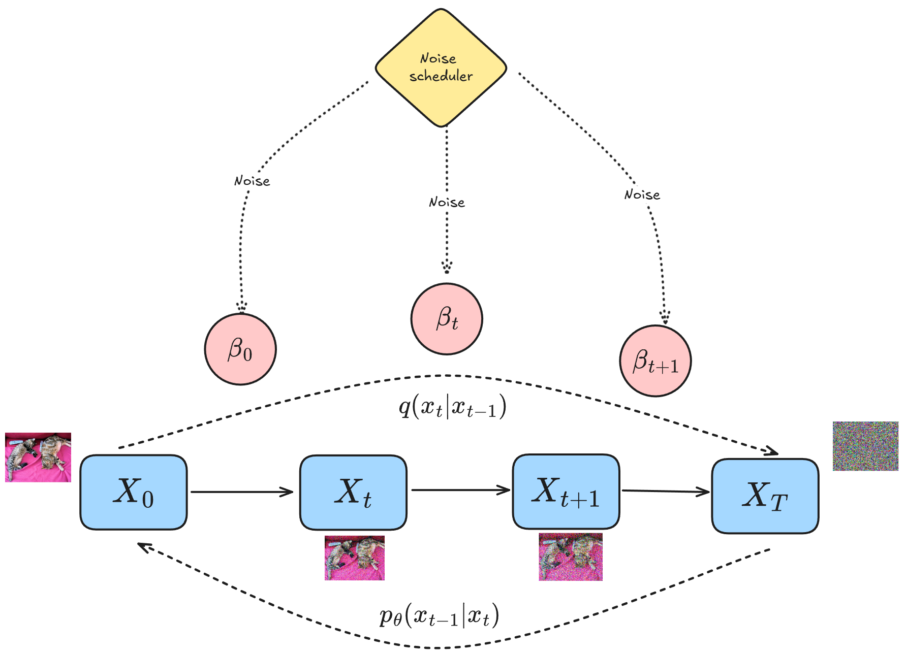
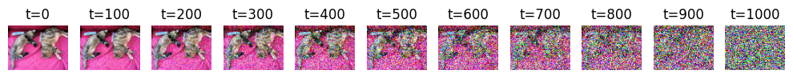
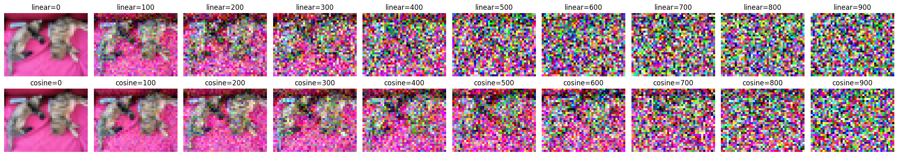
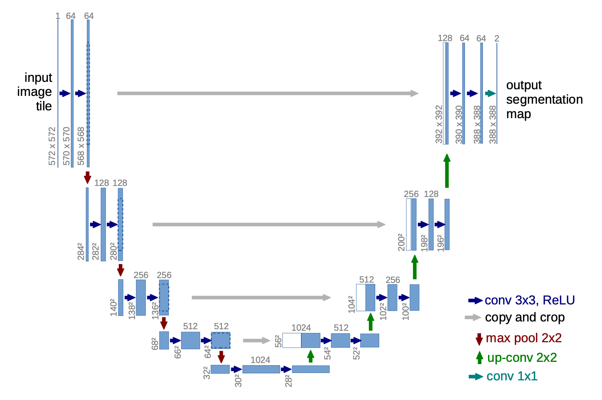
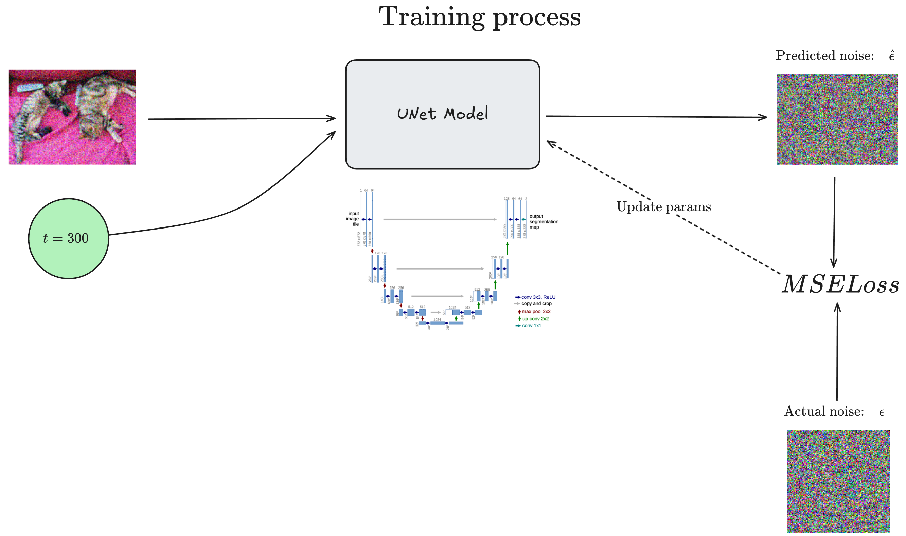
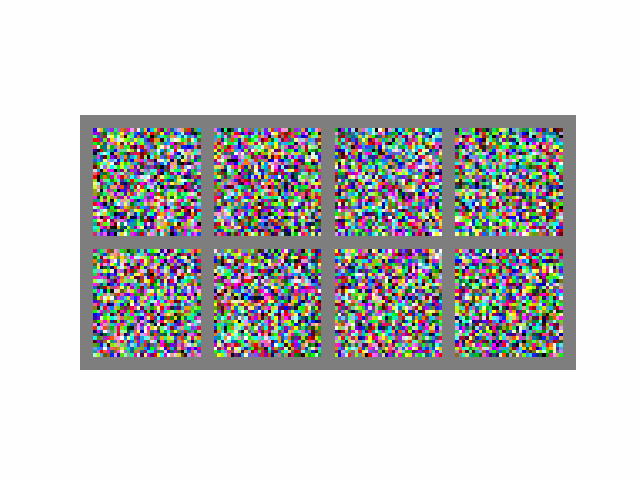
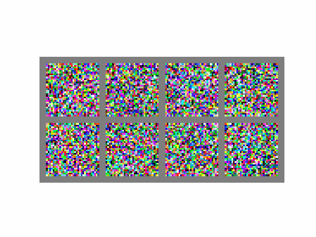

# Understanding the diffusion process

In this blog post, I will attempt to explain the key ideas of the paper ["Denoising Diffusion Probabilistic Models" by Ho et al.](https://arxiv.org/abs/2006.11239), which introduced the concept of diffusion models for image generation, paving the way for the development of text-to-image models such as DALL-E and Stable Diffusion. These models usually perform much better than GANs and are more stable to train, making them the de-factor industry standard for generative modelling. The actual paper is quite dense and technical, so I will try to simplify the key ideas and concepts in a more general way.

In brief, diffusion models train a neural network to predict the amount of noise that should be removed from a synthetically-noised image to recover the original image. By doing so over multiple images and noise levels, the hypothesis is that the network learns the latent space of the training data. This is a very high-level overview, and I will go into more detail in the following sections.

If you're looking for a more technical explanation, I highly recommend [Lilian Weng's amazing blog post](https://lilianweng.github.io/posts/2021-07-11-diffusion-models/) covering the whole field in great detail.

## An overview of the training process

When training a diffusion model, the high-level steps are:

- Run an image through a forward diffusion process to add noise to it.
- Run the noisy image back through a neural network to predict the amount of noise that should be removed.
- Calculate the loss between the predicted noise and the actual noise
- Update the neural network parameters to minimize the loss using backpropagation.
- Repeat, repeat, repeat.

Let's now go through each of these steps in more detail.

## Forward diffusion process (or adding noise)

Given an image (say $x_0$), the forward diffusion process $q(x_t | x_{t-1})$ adds a small amount of Gaussian noise at each timestep to create a sequence of progressively noisy images ($x_1, x_2, \ldots, x_T$), as shown in the figure below: 

Although the idea is to add noise progressively, a few mathematical tricks (namely, [reparametrization](https://theaisummer.com/diffusion-models/#the-reparameterization-trick-tractable-closed-form-sampling-at-any-timestep)) allow us to sample the noisy image $x_t$ at any arbitrary timestep $t$ without having to compute the intermediate images $x_1, x_2, \ldots, x_{t-1}$. The amount of noise is controlled by a noise scheduler, which is typically parameterized by $\beta$.

### Noise schedulers

The amount of noise that is added at each timestep is controlled by a noise scheduler, which is a function that maps the timestep $t$ to a particular variance level, thereby controlling the amount of noise added. The two most common noise schedules are the linear schedule ([Ho et al. (2020)](https://arxiv.org/abs/2006.11239)) and the cosine schedule ([Nichol & Dhariwal (2021)](https://arxiv.org/abs/2102.09672)). The difference between the two can be seen in the figure below: 

As you can see, the linear schedule adds noise linearly, which usually leads to extremely noisy images towards the middle of the diffusion process, while the cosine schedule adds noise in a more controlled manner.

## Backward diffusion process (or removing noise)

At this point, we have a noisy image ($x_t$) on our hands, and the amount of noise that was added to it ($\epsilon$). It would be great if we could reverse the above noising process perfectly, as then we could go from $x_t$ to $x_0$ without any issues. However, this is not possible as learning the distribution $p(x_{t-1} | x_t)$ has too many possible solutions.

Instead, we attempt to learn a neural network $\epsilon_{\theta}(x_{t-1} | x_t)$ that predicts the amount of noise that can be removed from $x_t$ to recover $x_{t-1}$. And since we have the actual noise that was added to $x_t$ ($\epsilon$), we can calculate the loss between the predicted noise and the actual noise, and update the neural network parameters to minimize this loss using backpropagation.

### The neural network

In the original paper, the authors used a U-Net model with sinusodial positional encodings and self-attention as the backbone for the neural network.

The [U-Net model](https://en.wikipedia.org/wiki/U-Net) is a popular choice for diffusion models as it takes an image as input, encodes it into a latent space, and then decodes it back into the original image, with the added benefit of skip connections that help in gradient flow during training. It is made up of a series of ResNet blocks, which itself is made up of a series of convolutional layers, group normalization layers, and [`SiLU`](https://pytorch.org/docs/stable/generated/torch.nn.SiLU.html) activation functions. The image below shows the architecture of a U-Net model, taken from the [original paper](https://arxiv.org/abs/1505.04597):

The sinusodial positional encoding helps the model share parameters across time, and understand what timestep it is currently predicting the noise for, as the self-attention blocks do not have any positional information. This idea was made popular in the paper ["Attention is All You Need" by Vaswani et al. (2017).](https://arxiv.org/abs/1706.03762).

## Loss function

The loss between the predicted noise and the actual noise is calculated using the mean squared error (MSE) loss function, which is defined as:

$$\left\Vert\epsilon - \epsilon_{\theta}(x_{t-1} | x_t, t) \right\Vert^2$$

The training process tries to minimize this loss using gradient descent. In the original paper, the authors used the [`Adam`](https://pytorch.org/docs/stable/generated/torch.optim.Adam.html) optimizer with a learning rate of $2 \times 10^{-4}$ and a batch size of 128.

The training process can be visualized as: 

This process of adding noise, predicting the noise that should be removed, and updating the neural network parameters is repeated multiple times until the neural network converges to a good solution, or until the training budget is exhausted (most likely the latter).

## Sampling from the model

Training the model is only half the challenge. The other half is using the trained model to actually generate new images from random noise. I will talk about two methods to sample from the model, namely the method proposed in the [original DDPM paper](https://arxiv.org/pdf/2006.11239), and the method proposed as a faster alternative in the [DDIM paper](https://arxiv.org/pdf/2010.02502).

The next sections might get a bit technical, so feel free to skip them if you're not interested in the details. The GIFs shown below are from a model that I trained on CIFAR-10 for ~20 epochs (which is not enough for good quality images, but enough to understand the process) while writing this blog post.

The key takeaway is that to generate an image from a trained diffusion model, we start with a random noise tensor, and run the backward diffusion process in an autoregressive manner over the sequence (or a subset of the sequence) to generate the final image.

### DDPM sampling

In this method, we start with a random noise tensor $x_t \sim \mathcal{N}(0, 1)$ and run the backward diffusion process in an autoregressive manner over the entire timestep sequence $\left\{x_t, x_{t-1}, \ldots, x_0\right\}$ to generate the final image. At each timestep $t$, a part of the predicted noise $\epsilon_{\theta}(x_t, t)$ is removed from the image $x_t$, to get the image $x_{t-1}$.

Mathematically, this is represented as:

$$
x_{t-1} = \frac{1}{\sqrt{\alpha_t}} \left( x_t - \frac{1 - \alpha_t}{\sqrt{1 - \bar{\alpha}_t}} \epsilon_{\theta}(x_t, t) \right) + \sigma_t z
$$

where,

- $x_t$ is the noisy image at timestep $t$.
- $\epsilon_{\theta}(x_t, t)$ is the predicted noise that should be removed from $x_t$
- $\alpha_t$ is simply $1 - \beta_t$.
- $\bar{\alpha}_t$ is the cumulative product of $\alpha_t$, i.e., $\bar{\alpha}_t = \prod_{i=0}^{t} \alpha_i$.
- $\sigma_t$ is the standard deviation of the model, which the authors fix to either $\beta_t$ or $\tilde{\beta_t}=\frac{1-\bar{\alpha}_{t-1}}{{1-\bar{\alpha}_t}}$. This was done more for simplicity, and the paper by [Nichol & Dhariwal (2021)](https://arxiv.org/pdf/2102.09672) talks about learning this parameter as well.
- $z$ is a random noise tensor sampled from $\mathcal{N}(0, 1)$ until the final timestep $t=0$.

Visually, the process looks like this: 

If we assume $T=1000$, then to generate a single batch of images, the above equation is computed 1000 times, which is quite slow. From [Song et. al (2020)](https://arxiv.org/abs/2010.02502), *"it takes around 20
hours to sample 50k images of size 32 × 32 from a DDPM"*.

### DDIM sampling

The paper "Denosing Diffusion Implicit Models" by Song et al. (2020) proposed a faster alternative to sampling from a model trained with the same objective as the DDPM model. The key idea they introduced is to have a new hyperparameter $\eta$, which controls the amount of stochasticity in the sampling process. By setting $\eta = 0$, the sampling process becomes deterministic. Moreover, we do not need to follow the whole chain from $t = T, T-1, \ldots, 0$ to generate an image, but rather a subset $S$ ($S \lt T$) of the timesteps.

Mathematically, the DDIM process is represented as:

$$
x_{t-1} = \sqrt{\alpha_{t-1}} \left( \frac{x_t - \sqrt{1 - \alpha_t} \cdot \epsilon_{\theta}(x_t,t)}{\sqrt{\alpha_t}} \right) + \sqrt{1 - \alpha_{t-1} - \sigma_t^{2}} \cdot \epsilon_{\theta}(x_t,t) + \sigma_t \epsilon_t \\
$$

$$
\sigma_t = \eta \cdot \sqrt{\frac{1 - \alpha_{t-1}}{1 - \alpha_t}} \cdot \sqrt{1 - \frac{\alpha_t}{\alpha_{t-1}}} \\
$$

where,

- $t$ is a sub-sequence of timesteps, controlled by the hyperparameter $S$.
- $x_t$ is the noisy image at timestep t.
- $\epsilon_{\theta}(x_t, t)$ is the predicted noise that should be removed from $x_t$
- $\alpha_t$ is equivalent to $\bar{\alpha}_t$ in the DDPM sampling process, i.e., $\alpha_t = \prod_{i=0}^{t} 1-\beta_i$.
- $\eta$ is the hyperparameter that controls the amount of stochasticity in the sampling process.

From the above equations, we can see that the DDIM sampling process approximates the $x_0$ image at each timestep (the first term in the equation). The second term of the equation computes the direction pointing to the $x_t$ image, which allows this process to essentially skip a few timesteps. Finally, the last term of the equation adds a small amount of noise in the denoising step.

Visually, the process looks like this when $S=100, \eta=0.0$: 

If we set $\eta=0$, then the process becomes completely deterministic as the $\sigma_t$ term becomes 0. At $\eta=1$, we are back to the DDPM sampling process (the derivation is simple but lengthy, please see [this article](https://betterprogramming.pub/diffusion-models-ddpms-ddims-and-classifier-free-guidance-e07b297b2869) for more).

The choice between DDPM and DDIM sampling is a trade-off between speed and quality. DDPM sampling is slower but produces better quality images, while DDIM sampling is faster but produces slightly worse quality images. However, recent research has introduced even better methods such as [latent diffusion models](https://arxiv.org/abs/2112.10752) which run on a smaller latent space instead of the original pixel space.

## Conclusion

I hope this blog post helped you understand the key idea behind the diffusion process, and how it is used to generate images. Although the original paper is now quite old as newer, better models have been introduced, I wanted to understand the basics first, before diving into the more advanced models.

The code to train a DDPM-based model on CIFAR-10 is available on my [GitHub repository](https://github.com/lakshyaag/Deep-Learning-From-Scratch/). Please feel free to reach out to me if you have any questions or suggestions. I would love to hear from you! I can be reached on [X/Twitter](https://x.com/lakshyaag), or [LinkedIn](https://linkedin.com/in/lakshyaag).

## References

- [Denoising Diffusion Probabilistic Models by Ho et al. (2020)](https://arxiv.org/abs/2006.11239)
- [Denosing Diffusion Implicit Models by Song et al. (2020)](https://arxiv.org/abs/2010.02502)
- [Attention is All You Need by Vaswani et al. (2017)](https://arxiv.org/abs/1706.03762)
- [Understanding Diffusion Models by Lilian Weng](https://lilianweng.github.io/posts/2021-07-11-diffusion-models/)
- [Diffusion Models, DDPMs, DDIMs, and Classifier-Free Guidance by Better Programming](https://betterprogramming.pub/diffusion-models-ddpms-ddims-and-classifier-free-guidance-e07b297b2869)
